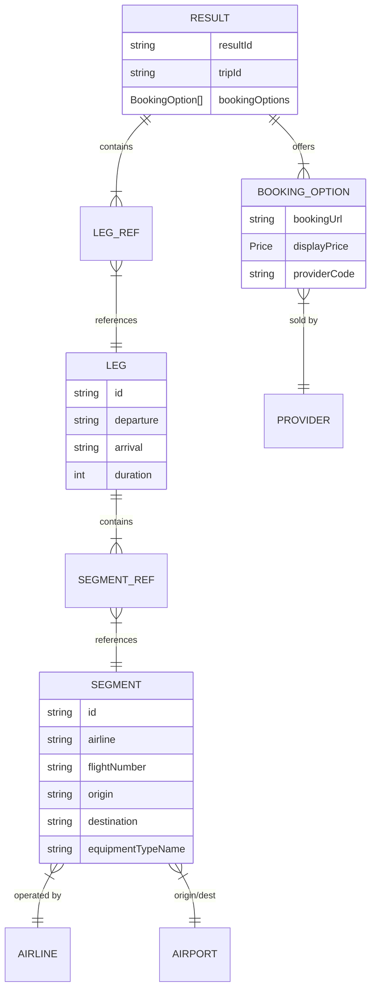

# Flight Search Response Analysis

This document provides a comprehensive analysis of the `flightSearchResp.json` file, detailing its data structure, field definitions, and implications for implementing a flight booking flow.

## 1. High-Level Structure

The JSON response uses a **normalized data model**. Instead of checking deeply nested objects for every flight result, the data is split into distinct entities (Results, Legs, Segments) that reference each other via IDs. This reduces redundancy, as multiple flight results might share the same legs or segments.

The root object contains a `data` object with the following key collections:

- **`results`**: The main list of flight options (and advertisements).
- **`legs`**: Dictionary of flight legs (e.g., Outbound flight details), keyed by Leg ID.
- **`segments`**: Dictionary of individual flight segments (atomic flights), keyed by Segment ID.
- **`airlines`**: Reference data for airlines, keyed by IATA code (e.g., 'NK', 'UA').
- **`airports`**: Reference data for airports, keyed by IATA code (e.g., 'LAX', 'MCO').
- **`providers`**: Reference data for booking providers (OTAs or Airlines), keyed by Provider Code.
- **`filterData`**: Metadata for search filters (stops, airlines, price ranges).

## 2. Data Entity Relationship Diagram

## 3. Detailed Field Analysis

### 3.1. `data.results` (List)

This list contains the search results. Note that it is **heterogeneous** and contains both flight itineraries and advertisements.

- **Identifying Flight Itineraries**: Look for items containing `legs` and `bookingOptions` arrays.
- **Identifying Ads**: Look for items containing `adType` (e.g., "sponsored").

#### Flight Itinerary Item Structure:

| Field                   | Type         | Description                                                                       |
| :---------------------- | :----------- | :-------------------------------------------------------------------------------- |
| `resultId`              | String       | Unique identifier for this specific result option.                                |
| `tripId`                | String       | Identifier for the trip logic.                                                    |
| `legs`                  | List[Object] | Ordered list of legs (e.g., [0]=Outbound, [1]=Return). Contains `{id, segments}`. |
| `bookingOptions`        | List[Object] | List of booking offers. Usually contains price and provider info.                 |
| `isBest` / `isCheapest` | Boolean      | Flags indicating if this result is a "Best Match" or "Cheapest".                  |
| `score`                 | Number       | (If present) Internal ranking score.                                              |

### 3.2. `data.legs` (Dictionary)

Stored as `id -> object`. A "Leg" represents a continuous journey in one direction (e.g., LAX to MCO), which may overlap with multiple segments (stops).

| Field         | Type         | Description                                            |
| :------------ | :----------- | :----------------------------------------------------- |
| `id`          | String       | Unique ID (hash-like).                                 |
| `arrival`     | String (ISO) | Arrival date/time at the final destination of the leg. |
| `departure`   | String (ISO) | Departure date/time from the origin.                   |
| `duration`    | Integer      | Total duration in minutes.                             |
| `segments`    | List[Object] | Ordered list of segments that make up this leg.        |
| `stops`       | Integer      | Number of stops (calculated as `len(segments) - 1`).   |
| `airlineCode` | String       | Predominant airline for this leg.                      |

### 3.3. `data.segments` (Dictionary)

Stored as `id -> object`. A "Segment" is a single flight from one airport to another (e.g., Flight NK123 from LAX to DEN).

| Field               | Type         | Description                                             |
| :------------------ | :----------- | :------------------------------------------------------ |
| `id`                | String       | Unique ID.                                              |
| `airline`           | String       | Code (e.g., "NK") referencing `data.airlines`.          |
| `flightNumber`      | String       | Flight number (e.g., "1234").                           |
| `origin`            | String       | Airport code (e.g., "LAX") referencing `data.airports`. |
| `destination`       | String       | Airport code (e.g., "DEN") referencing `data.airports`. |
| `departure`         | String (ISO) | Segment departure time.                                 |
| `arrival`           | String (ISO) | Segment arrival time.                                   |
| `duration`          | Integer      | Segment duration in minutes.                            |
| `equipmentTypeName` | String       | Aircraft model (e.g., "Airbus A320").                   |
| `cabin`             | String       | Cabin class (e.g., "Economy").                          |

### 3.4. `bookingOptions` (Inside Result)

This array contains the pricing and "action" part of the result.

| Field          | Type   | Description                                                                             |
| :------------- | :----- | :-------------------------------------------------------------------------------------- |
| `displayPrice` | Object | Contains `price` (Integer) and `currency`, `localizedPrice` (String).                   |
| `bookingUrl`   | Object | Contains `url` or `urlType` indicating where to redirect. Usually contains a deep link. |
| `providerCode` | String | Links to `data.providers` (e.g., 'SPIRIT' for Spirit Airlines).                         |
| `fees`         | Object | Breakdown of baggage fees and other surcharges.                                         |

## 4. Implementation Guide for Booking Flow

To implement the flight booking flow using this data, the frontend/backend should follow these steps:

### Step 1: Parsing & Filtering

1.  Iterate through `data.results`.
2.  **Filter Filter**: Exclude any item that does not have a `legs` property (these are ads).
3.  **Pagination**: Respect `data.pageSize` and `data.pageNumber` if implementing server-side pagination (though this file seems to be a complete snapshot).

### Step 2: Constructing the View Model

For each valid flight result:

1.  **Resolve Legs**:
    - Iterate through `result.legs`. access `id`.
    - Lookup the full leg details in `data.legs[id]`.
    - Calculate total duration and number of stops.

2.  **Resolve Segments**:
    - Inside each Leg, iterate through `leg.segments`.
    - Lookup segment details in `data.segments[id]`.
    - **Get Airline Info**: Use `segment.airline` to fetch name/logo from `data.airlines`.
    - **Get Airport Info**: Use `segment.origin/destination` to fetch city/names from `data.airports`.

3.  **Resolve Price & Provider**:
    - Access `result.bookingOptions[0]` (Primary option).
    - Display `displayPrice.localizedPrice`.
    - Lookup `providerCode` in `data.providers` to show "Book with Spirit" or "Book with Expedia".

### Step 3: Handling User Selection

When a user selects a flight:

- **Redirect**: Use `bookingOptions[0].bookingUrl.url`. Note that this might be a relative or absolute URL. The JSON example shows `urlType: "absolute"`.
- **Deep Linking Details**: The URL usually contains a token or search ID that allows the provider to reconstruct the offer.

### Important Considerations

- **Caching**: The `data` object separates entities. A frontend state manager (like Redux or Zustand) should likely store these "normalized" tables (`legs`, `segments`, `airlines`) separately from the `results` list to avoid data duplication.
- **Timezones**: Times are typically in local airport time or UTC. Check if `arrival`/`departure` strings have offsets (e.g., `2025-06-15T10:00:00-07:00`). If no offset is provided, they are usually "Local Time at Airport".
- **Layovers**: Layovers are implicit. If a Leg has 2 segments, the time between Segment 1 Arrival and Segment 2 Departure is the layover.
